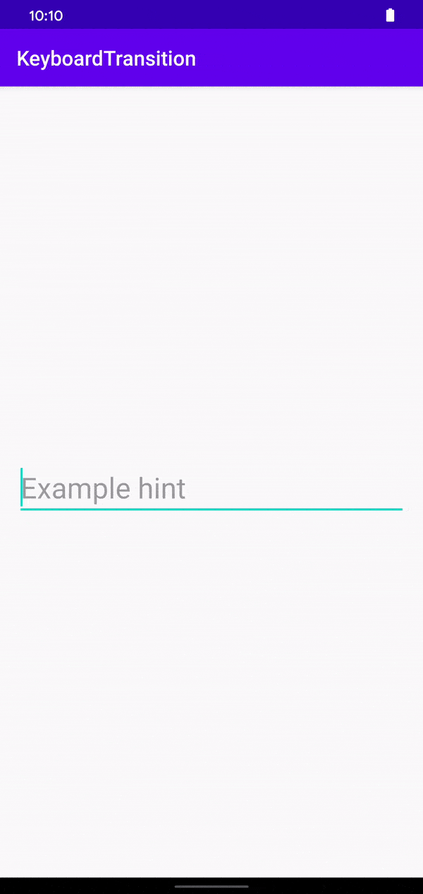

# Description
Example how one could potentially animate a MotionLayout based on keyboard visibility in Android R.

Currently Android R is only available as Developer Preview, which makes this not production ready.
It does show what the future can bring us.

# Example

